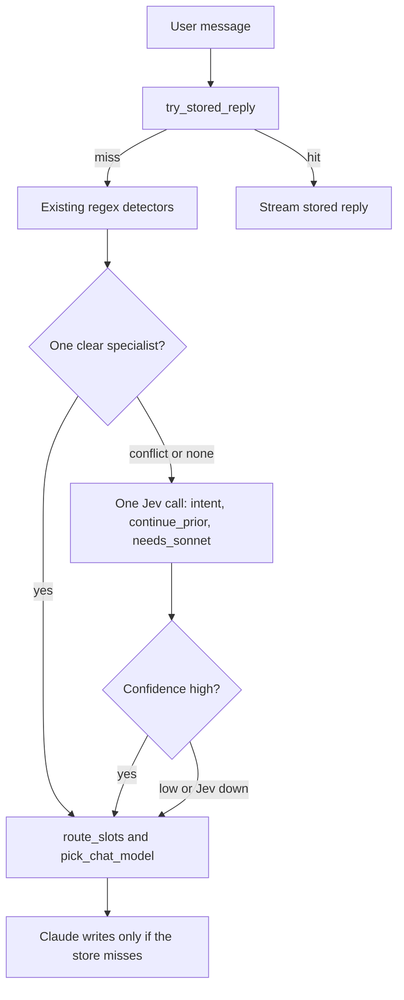

# Use Jev as a disambiguator, not a new answer model

Saved Sep 23, 2026. This is a plan only. Nothing here is built yet.

Jev (TypeSafe System One, currently `jev-1.13.0`) returns a choice, a score, or a yes/no probability. It does not write text. RealmPal already spends Claude only when a stored wiki, build, dungeon, set, or skin reply misses. The fragile part is deciding which of those paths a sentence belongs to. That decision is a pile of regexes in [`api/services/slot_graph.py`](../api/services/slot_graph.py) (`route_slots`), [`api/services/realmshark.py`](../api/services/realmshark.py) (`parse_query` / `_has_own_topic`), and the `is_*_query` helpers, then a second regex in [`api/services/model_route.py`](../api/services/model_route.py) (`pick_chat_model`).

Those regexes are the right tool when the wording is obvious (`best attack bard`, `how to do moonlight village`). They are the wrong tool when two detectors both match, or when a short follow-up inherits the wrong earlier topic. Live misses already documented in the backlog and chat-quality notes: a snake-eye enchant question inheriting Ninja/Attack from history, a DPS swap landing on the skin visualizer, a skin correction (`sorry I mean ...`) falling through to Haiku plus irrelevant RAG.

## Where it helps

One request can ask several questions against the same short state (the current message plus the last user turn). Official pricing is $0.042 per million input tokens, so a few hundred tokens is noise next to a Sonnet reply. Latency is the real cost (tens to a few hundred milliseconds), which is why Jev stays off the stored-answer fast path in [`api/routers/chat.py`](../api/routers/chat.py).

Ask only atomic questions, then combine them in code:

- **Choice `intent`**: `build`, `dps`, `enchant`, `forge`, `dungeon`, `set`, `skin`, `player`, `item`, `other`. Criteria written from the cases the regexes already get wrong.
- **Noul `continues_prior`**: this turn is a thin follow-up of the previous user message (other rings, sorry I mean, what if he swapped). Feeds `parse_query` history inheritance instead of gluing class and stat whenever the current sentence has none.
- **Noul `needs_sonnet`**: the ask needs a comparison, a constraint, or a first-time build. Feeds `pick_chat_model` only when the existing Haiku/Sonnet rules do not already force Sonnet (attachments, DPS numbers, constrained asks).

Keep nickname resolution (`brd` to Bard, `cbow` to Coral Bow), DPS reconstruction, and wiki retrieval exactly as they are. Those are catalogs and formulas. Jev would make them worse.

## What not to do

- Do not call Jev on every message. A clean regex hit should stay instant and offline.
- Do not let a low-confidence answer override a detector that already matched. Fall back to today's path if confidence is low, the call errors, or `TYPESAFE_API_KEY` is unset.
- Do not generate the chat reply with Jev. It cannot.
- Do not use unofficial proxies (`jevtypesafeai.com` and similar). The contract is `POST https://api.typesafe.ai/v1/systemone` with `TYPESAFE_API_KEY`. Pin `jev-1.13.0` once thresholds are tuned. `jev-latest` can move.

## First slice, if we build it

- New [`api/services/jev_route.py`](../api/services/jev_route.py): one httpx call, no new SDK dependency unless the official `typesafe-sdk` proves smaller. Settings flag default off in [`api/config.py`](../api/config.py) and [`.env.example`](../.env.example).
- Call it from the chat stream only after `try_stored_reply` misses and the regex set is ambiguous (zero intents, or two that the current priority order has historically swapped: skin vs DPS follow-up, enchant vs inherited build).
- Log the resolved model id, winning choice, and confidence. Do not log the API key.
- Tests with a mocked HTTP response: high-confidence skin correction overrides the miss; low confidence leaves `route_slots` unchanged; timeout leaves the regex path unchanged.
- User-facing changelog only if the flag is on in production and people can feel fewer wrong specialists. Until then this stays internal (developer changelog note when it ships).
